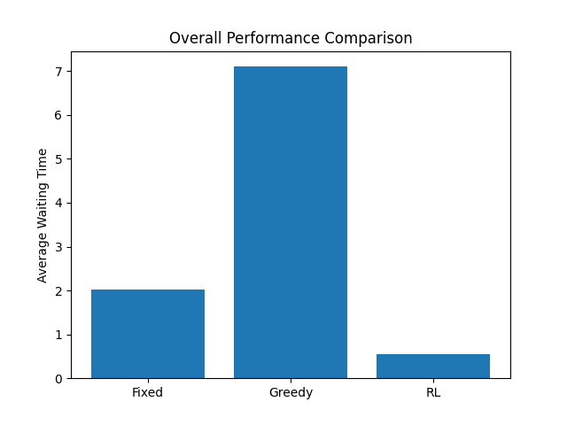
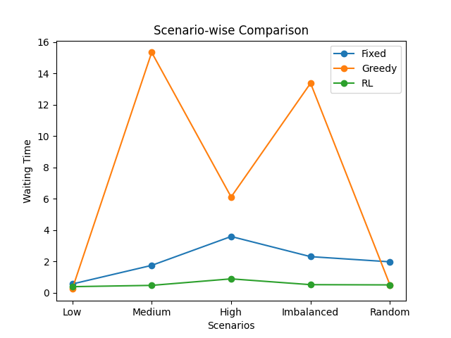

# 🚦 Smart Traffic Signal Optimization using Reinforcement Learning (DQN + SUMO)

## 📌 Overview

This project implements an intelligent traffic signal control system using **Deep Reinforcement Learning (DQN)** and **SUMO (Simulation of Urban Mobility)**.

The system learns adaptive signal policies to **minimize vehicle waiting time** and **reduce congestion**, outperforming traditional fixed and greedy methods.

---

## 🎯 Problem Statement

Traditional traffic signals operate on fixed timing cycles, which leads to:

* Traffic congestion 🚗
* Increased waiting time ⏳
* Inefficient road utilization

---

## 💡 Solution

We use:

* **SUMO** → realistic traffic simulation
* **Deep Q-Network (DQN)** → adaptive signal control
* **Evaluation framework** → compares RL with baseline strategies

---

## ⚙️ Technologies Used

* Python
* PyTorch
* SUMO (Simulation of Urban Mobility)
* Matplotlib

---

## 🚀 Features

* DQN-based traffic signal optimization
* Experience Replay + Target Network
* Multi-scenario testing:

  * Low traffic
  * Medium traffic
  * High traffic
  * Imbalanced traffic
* Comparison with:

  * Fixed timing
  * Greedy strategy
* Performance visualization using graphs

---

## 📊 Results

### 🔹 Overall Comparison

### 🔹 Scenario-wise Comparison

---

## 📈 Performance Summary

| Method | Avg Waiting Time |
| ------ | ---------------- |
| Fixed  | ~2.03            |
| Greedy | ~7.10            |
| RL     | ~0.54 ✅          |

👉 RL reduces waiting time by ~70–90% in complex scenarios.

---

## 📁 Project Structure

traffic_project/
├── train.py
├── evaluate.py
├── config.sumocfg
├── *.rou.xml
├── *.net.xml
├── best_model.pth
├── *.png

---

## ▶️ How to Run

### 🔹 Train

python train.py

### 🔹 Evaluate

python evaluate.py

---

## 🎓 Key Learning Outcomes

* Applied Reinforcement Learning to real-world traffic problem
* Integrated ML with simulation (SUMO)
* Designed evaluation and visualization pipeline

---

## 🔮 Future Improvements

* Multi-intersection control
* Real-time API integration
* Graph Neural Networks
* Smart city deployment

---

## ⭐ Support

If you like this project, give it a ⭐
